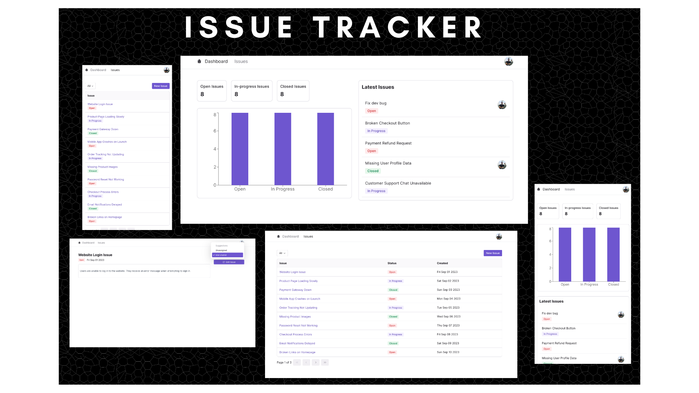

---

# 🚀 Issue Tracker - Powered by Next.js


> The Next.js Issue Tracker is a feature-rich web application designed to streamline issue management and tracking for teams and organizations. Leveraging a tech stack comprising Next.js, App Router, NextAuth, TypeScript, Radix-UI, Tailwind CSS, Prisma, MySQL, Zod, and React Query, this app offers a robust and user-friendly solution for managing and resolving issues.



This is a [Next.js](https://nextjs.org/) project bootstrapped with [`create-next-app`](https://github.com/vercel/next.js/tree/canary/packages/create-next-app).

## 🔧 Getting Started

First, run the development server:

```bash
npm run dev
# or
yarn dev
# or
pnpm dev
```

Open [http://localhost:3000](http://localhost:3000) with your browser to view the application.

You can start editing the page by modifying `app/page.tsx`. The app supports hot-reloading, so it auto-updates as you edit files.

This project uses [`next/font`](https://nextjs.org/docs/basic-features/font-optimization) to automatically optimize and load the Inter font, a custom Google Font.

---

## 🌟 Features

- **Dashboard with Issue Stats:** View "OPEN," "IN PROGRESS," and "CLOSED" issue counts at a glance.
- **Issue Board:** Filter, paginate, and sort issues with ease.
- **Create, Update, and Delete Issues:** Full issue lifecycle management with Markdown support for rich formatting.
- **User Assignment:** Assign tasks to team members to ensure accountability.
- **Responsive Design:** Optimized for both desktop and mobile devices.
- **SEO-Friendly:** Follows best practices for search engine optimization.
- **Performance:** Built with a focus on speed and user experience.

---

## 🛠 Tech Stack

- **Frontend:** Next.js, TypeScript, Radix-UI, Tailwind CSS
- **Backend:** Prisma, MySQL, NextAuth (Authentication)
- **Libraries:** Zod (Schema validation), React Query (Data management)

---

## 📚 Learn More

To learn more about Next.js, visit the following resources:

- [Next.js Documentation](https://nextjs.org/docs) - Features and API overview.
- [Learn Next.js](https://nextjs.org/learn) - An interactive tutorial for learning Next.js.
- [Next.js GitHub](https://github.com/vercel/next.js) - Provide feedback and contribute to the Next.js repo.

---

## 🚀 Deployment

The app is designed for easy deployment on platforms like Vercel, Heroku, or any cloud service supporting Node.js. You can follow the platform-specific instructions for deploying your Next.js app.

---

## 🤝 Contributing

Contributions are always welcome!  
1. Fork the repository.  
2. Create a new feature branch (`git checkout -b feature-branch`).  
3. Commit your changes (`git commit -m 'Add new feature'`).  
4. Push the branch (`git push origin feature-branch`).  
5. Open a pull request.

---

## 📄 License

This project is licensed under the **MIT License**.

---

This version makes the content structured and easy to follow, with helpful explanations and clear formatting.
